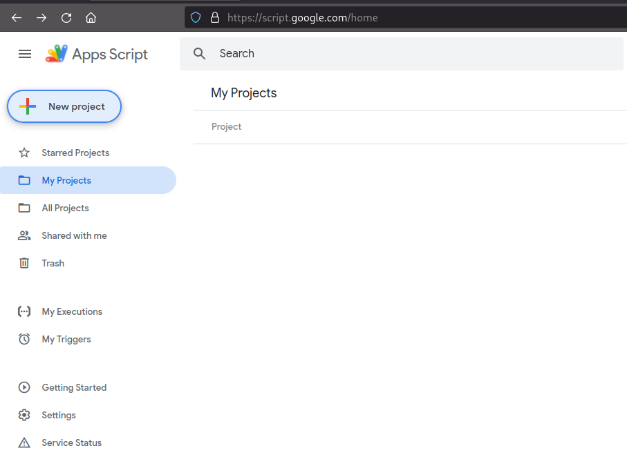
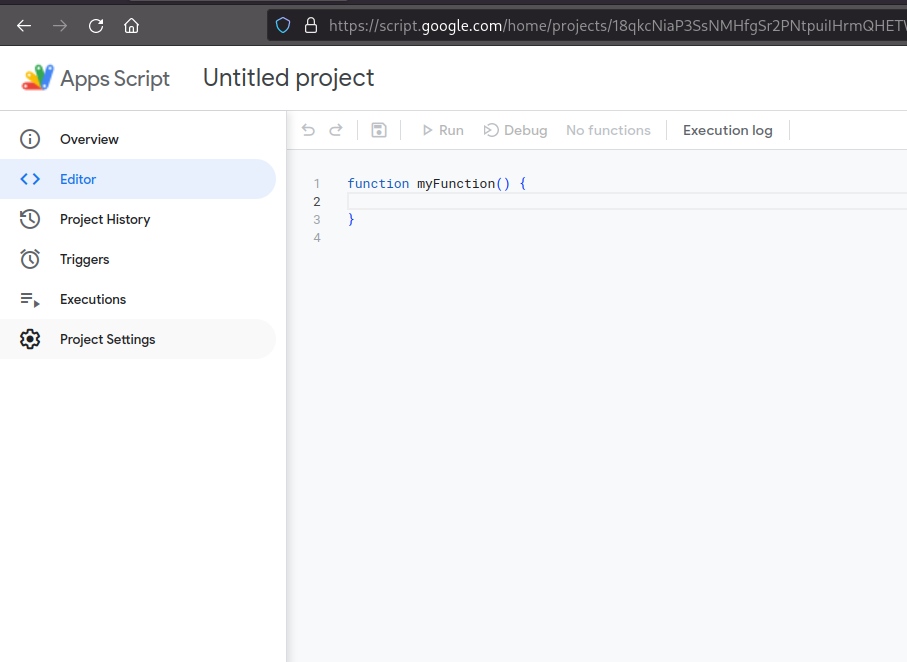
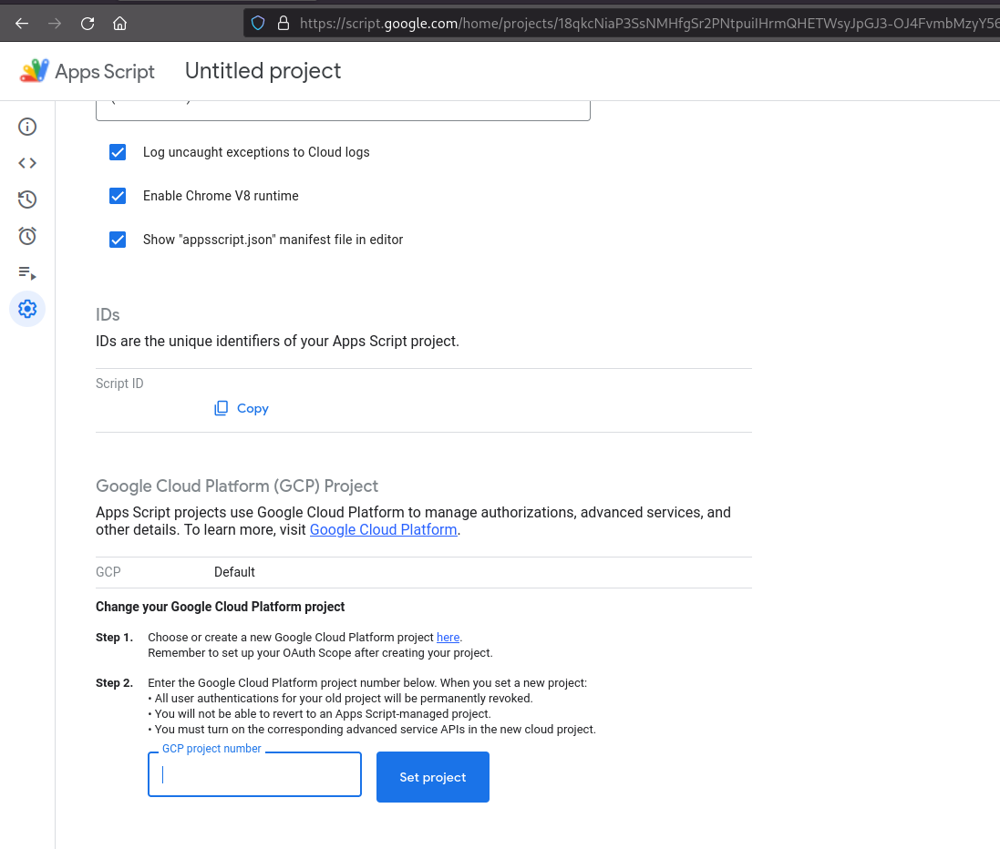
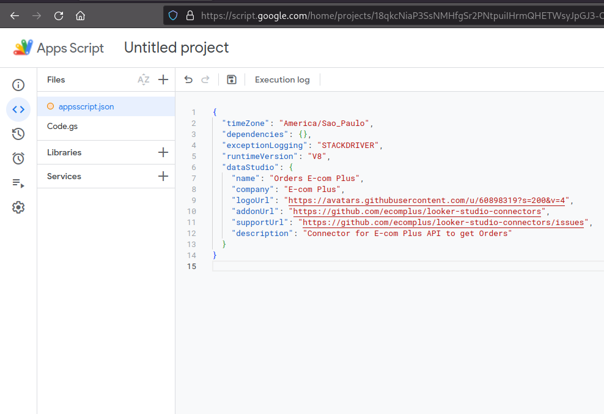
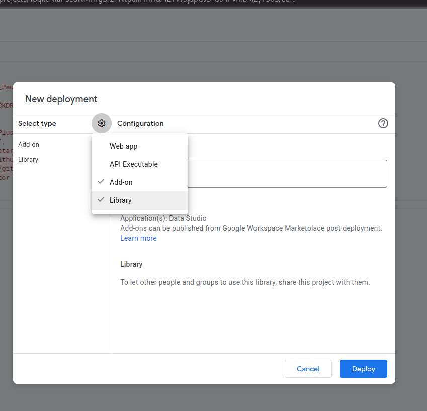
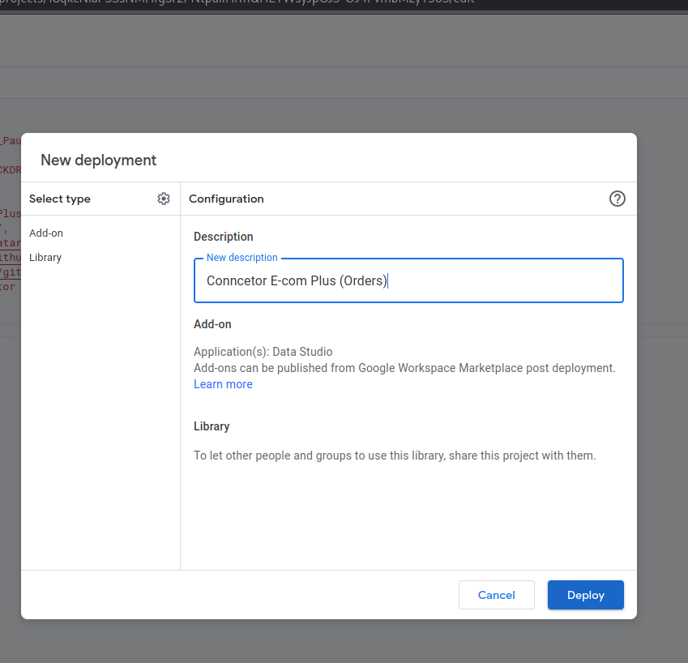
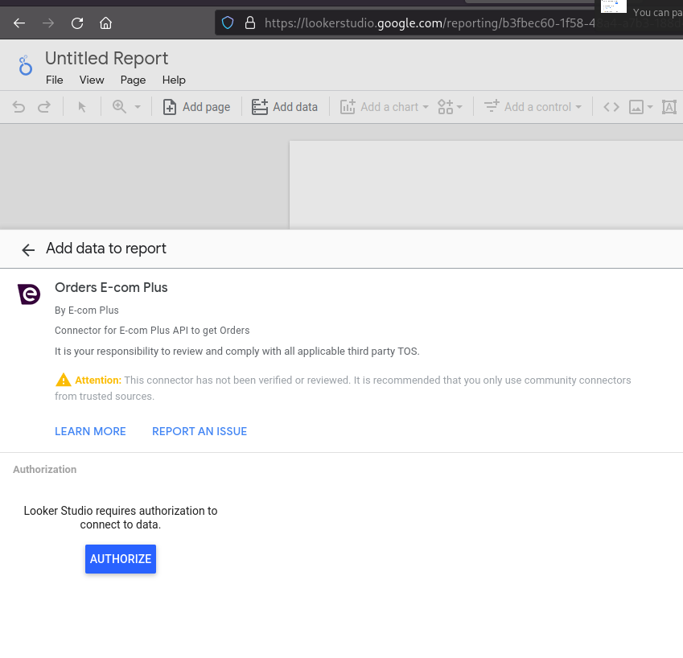
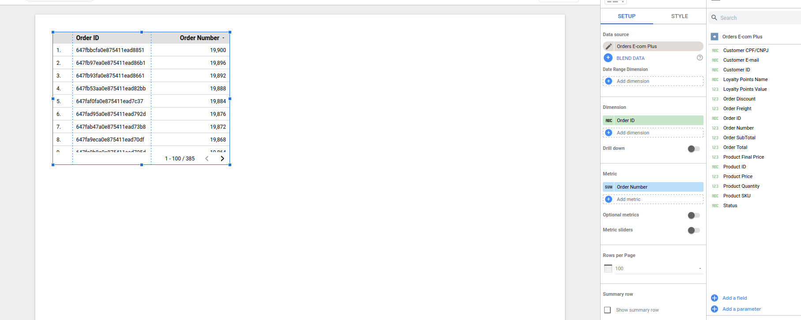

# Looker Studio connectors

[:brazil: Tradução em português](./README_pt_br.md)

Custom scripts for Looker Studio connectors to e-com.plus APIs

Inspiration: https://apptivasoftware.com/blog/bringing-json-data-from-an-api-into-looker-studio/

Other references: 

[1] https://github.com/davidtheweiss/Apps-Script-Season-15-Data-Studio-Service

[2] https://developers.google.com/looker-studio/connector/reference

[3] https://developers.e-com.plus/docs/reference/

[4] https://community.e-com.plus/t/aggregation-para-lista-de-produtos-mais-pedidos-em-um-determinado-periodo/3840

[5] https://www.mongodb.com/docs/manual/core/aggregation-pipeline-optimization/


# Setup

**Requirements:**

* [Create a project in Gclod](#a1)
* [Configure consent screen in Gcloud Project](#a2)
* [Create a Google appscript](#a3)
* [Connecting appscript to looker studio](#a4)

<br/>

<a id="a1"></a>

## Create a project in Gclod

Access the [GCloud console](https://console.cloud.google.com/)

1) Click select project

<br/>


<br/>

2) Click New Project

<br/>


<br/>

3) Set a name for your project and select the organization (optional)

<br/>


<br/>

4) After creating the project, go to the search menu and search for "oauth" and select "OAuth consent screen"

<br/>


<br/>

<a id="a2"></a>

## Configure consent screen in Gcloud Project

1) It is not necessary to select the User Type, proceed with the creation steps by filling in the mandatory data.

**Steps:**
* OAuth consent screen
* Scopes
* Optional info
* Summary 

<br/>


<br/>

2) In the last step of creation click "back to dashboard"

<br/>


<br/>

3) Then click on "Publish App"

<br/>


<br/>

4) Go back to the Gcloud console home screen and copy the Project Number

<br/>


<br/>

<a id="a3"></a>

## Create a Google appscript

With the same Gcloud project it is possible to create more than one Connector

In this example, we will create a connector that will fetch all orders from your store and return the following data: **_Order number, Order ID, document number, email, customer ID, amount (total, subtotal, freight, discount), loyalty points, status and items (product ID, sku, quantity, price, final price)_** - so that they can be manipulated by Looker Studio

To create other connectors, simply make the necessary changes to the `appscript.json` and `Code.gs` files (specifically in the `schema` and the `getData()` function)

Let's go...

Access the [appscript Google](https://script.google.com/)

1) Click "New Project"

<br/>


<br/>


2) Click "Project Settings"

<br/>


<br/>

2) Enable "Show 'appscript.json' mainfest file in editor"

<br/>


<br/>

2) In "Google Cloud Platform (GCP) Project"
* Click "Change Project"
* Paste Project Number
* Click "Set Project"

<br/>


<br/>

3) Go back to the "Editor" and select the "appscript.json" file
* Paste Code 
```JSON
{
  "timeZone": "America/Sao_Paulo",
  "dependencies": {},
  "exceptionLogging": "STACKDRIVER",
  "runtimeVersion": "V8",
  "dataStudio": {
    "name": "Orders E-com Plus",
    "company": "E-com Plus",
    "logoUrl": "https://avatars.githubusercontent.com/u/60898319?s=200&v=4",
    "addonUrl": "https://github.com/ecomplus/looker-studio-connectors",
    "supportUrl": "https://github.com/ecomplus/looker-studio-connectors/issues",
    "description": "Connector for E-com Plus API to get Orders"
  }
}
```
_**P.S.:** If it is another connector, make the necessary changes_

* Save file

<br/>


<br/>

4) Now select the file "code.gs" and paste the code
 ```js
 // Define the schema for the data structure of the connector
const schema = [
  { name: '_id', label: 'Order ID', dataType: 'STRING', semantics: { conceptType: 'DIMENSION' } },
  { name: 'number', label: 'Order Number', dataType: 'NUMBER', semantics: { conceptType: 'DIMENSION' } },
  { name: 'status', label: 'Status', dataType: 'STRING', semantics: { conceptType: 'DIMENSION' } },
  { name: 'buyers._id', label: 'Customer ID', dataType: 'STRING', semantics: { conceptType: 'DIMENSION' } },
  { name: 'buyers.main_email', label: 'Customer E-mail', dataType: 'STRING', semantics: { conceptType: 'DIMENSION' } },
  { name: 'buyers.doc_number', label: 'Customer CPF/CNPJ', dataType: 'STRING', semantics: { conceptType: 'DIMENSION' } },
  { name: 'amount.total', label: 'Order Total', dataType: 'NUMBER', semantics: { conceptType: 'DIMENSION' } },
  { name: 'amount.subtotal', label: 'Order SubTotal', dataType: 'NUMBER', semantics: { conceptType: 'DIMENSION' } },
  { name: 'amount.discount', label: 'Order Discount', dataType: 'NUMBER', semantics: { conceptType: 'DIMENSION' } },
  { name: 'amount.freight', label: 'Order Freight', dataType: 'NUMBER', semantics: { conceptType: 'DIMENSION' } },
  { name: 'items.product_id', label: 'Product ID', dataType: 'STRING', semantics: { conceptType: 'DIMENSION' } },
  { name: 'items.sku', label: 'Product SKU', dataType: 'STRING', semantics: { conceptType: 'DIMENSION' } },
  { name: 'items.quantity', label: 'Product Quantity', dataType: 'NUMBER', semantics: { conceptType: 'METRIC' } },
  { name: 'items.price', label: 'Product Price', dataType: 'NUMBER', semantics: { conceptType: 'METRIC' } },
  { name: 'items.final_price', label: 'Product Final Price', dataType: 'NUMBER', semantics: { conceptType: 'METRIC' } },
  { name: 'loyalty_points.name', label: 'Loyalty Points Name', dataType: 'STRING', semantics: { conceptType: 'DIMENSION' } },
  { name: 'loyalty_points.value', label: 'Loyalty Points Value', dataType: 'NUMBER', semantics: { conceptType: 'METRIC' } },
  { name: 'created_at', label: 'Created', dataType: 'STRING', semantics: { conceptType: 'DIMENSION', semanticType: 'YEAR_MONTH_DAY_SECOND'} },
  
]

// Return the defined schema to Data Studio
function getSchema(request) {
  return { schema: schema }
}

const cc = DataStudioApp.createCommunityConnector()
// Base API endpoint
const BASE_URL = 'https://api.e-com.plus/v1'

function md5(inputString) {
  return Utilities.computeDigest(Utilities.DigestAlgorithm.MD5, inputString)
    .reduce((output, byte) => output + (byte & 255).toString(16).padStart(2, '0'), '')
}

function getAuthType() {
  return cc.newAuthTypeResponse()
    .setAuthType(cc.AuthType.USER_PASS)
    .build()
}

// Check if the current user has administrative privileges
function isAdminUser() {
  return true
}

function resetAuth() {
  var userProperties = PropertiesService.getUserProperties()
  // userProperties.deleteProperty('dscc.key')
  userProperties.deleteProperty('ecom.authenticationId')
  userProperties.deleteProperty('ecom.apiKey')
  userProperties.deleteProperty('ecom.storeId')
  userProperties.deleteProperty('ecom.accessToken')
  userProperties.deleteProperty('ecom.expires')
}

async function requestAuthEcomplus(authenticationId, apiKey, storeId) {
  const body = {
    _id: authenticationId,
    api_key: apiKey
  }

  const options = {
    payload: JSON.stringify(body),
    headers: {
      'x-store-id': storeId
    }
  }
  return UrlFetchApp.fetch(`${BASE_URL}/_authenticate.json`, options)
}

function getUser() {
  const userProperties = PropertiesService.getUserProperties()
  const authenticationId = userProperties.getProperty('ecom.authenticationId')
  const apiKey = userProperties.getProperty('ecom.apiKey')
  const storeId = userProperties.getProperty('ecom.storeId')
  const accessToken = userProperties.getProperty('ecom.accessToken')
  return {
    userProperties,
    authenticationId,
    apiKey,
    storeId,
    accessToken
  }
}

async function isAuthValid() {
  const {
    userProperties,
    authenticationId,
    apiKey,
    storeId
  } = getUser()

  let accessToken = userProperties.getProperty('ecom.accessToken')
  const expires = userProperties.getProperty('ecom.expires')
  if (expires) {
    const dateExpires = new Date(expires).getTime()
    const now = new Date().getTime()
    if (now > (dateExpires - 1 * 60 * 60 * 1000)) {
      const resAuth = await requestAuthEcomplus(authenticationId, apiKey, storeId)
      if (resAuth.getResponseCode() !== 200) {
        return false
      }
      const responseAuth = JSON.parse(resAuth)
      userProperties.setProperty('ecom.accessToken', responseAuth.access_token)
      userProperties.setProperty('ecom.expires', responseAuth.expires)
      accessToken = responseAuth.access_token
    }
    const headers = {
      'x-store-id': storeId,
      'x-my-id': authenticationId,
      'x-access-token': accessToken
    }
    var res = UrlFetchApp.fetch(`${BASE_URL}/authentications/me.json`, { headers,  'muteHttpExceptions': true })
    return res.getResponseCode() === 200
  } else {
    return false
  }
}

async function setCredentials(request) {
  const rawUserParts = request.userPass.username.split(':')
  let storeId = 0
  let authUsername = ''
  let authId = ''
  if (rawUserParts.length === 2) {
    storeId = Number(rawUserParts[0])
    authId = rawUserParts[1]
  } else {
    authUsername = rawUserParts[0]
  }
  const rawPass = request.userPass.password
  let authApiKey = storeId && rawPass.length === 128 ? rawPass : ''
  const authPassMd5 = authApiKey ? '' : md5(rawPass);
  let loginData
  if (!authApiKey) {
    const resp = UrlFetchApp.fetch(`${BASE_URL}/_login.json`, {
      payload: JSON.stringify({
        username: authUsername,
        pass_md5_hash: authPassMd5,
      }),
      method: 'POST',
      headers: {
        'content-type': 'application/json',
        'x-store-id': storeId
      },
    });
    if (resp.getResponseCode() !== 200) {
      return cc.newSetCredentialsResponse()
        .setIsValid(false)
        .build()
    }
    loginData = JSON.parse(resp)
  }
  if (loginData) {
    storeId = loginData.store_id
    authId = loginData._id
    authApiKey = loginData.api_key
  }

  var userProperties = PropertiesService.getUserProperties()
  userProperties.setProperty('ecom.authenticationId', authId)
  userProperties.setProperty('ecom.apiKey', authApiKey)
  userProperties.setProperty('ecom.storeId', `${storeId}`)
  
  const resAuth = await requestAuthEcomplus(authId, authApiKey, `${storeId}`)
  if (resAuth.getResponseCode() !== 200) {
    return cc.newSetCredentialsResponse()
      .setIsValid(false)
      .build()
  }
  const responseAuth = JSON.parse(resAuth)
  userProperties.setProperty('ecom.accessToken', responseAuth.access_token)
  userProperties.setProperty('ecom.expires', responseAuth.expires)

  return cc.newSetCredentialsResponse()
    .setIsValid(true)
    .build()
}

function getConfig(request) {

}

function getData(request) {
  if (isAuthValid()) {
    const {
      userProperties,
      authenticationId,
      storeId,
      accessToken
    } = getUser()

    const dataSchema = schema.reduce((init, current) => {
      const isExist = request.fields.find(field => field.name === current.name)
      if (isExist) {
        init.push(current)
      }
      return init
    }, [])

    const listOrdersUrl = BASE_URL + '/$aggregate.json'
    const headers = {
      'X-Access-Token': accessToken,
      'X-Store-ID': storeId,
      'X-My-ID': authenticationId
    }

    const body= {
     "resource": "orders",
      "pipeline": [
         {
            "$project": {
                "number": 1,
                "status": 1,
                "buyers.doc_number": 1,
                "buyers.main_email": 1,
                "buyers._id": 1,
                "amount": 1,
                "loyalty_points": 1,
                "items.product_id": 1,
                "items.sku": 1,
                "items.quantity": 1,
                "items.price": 1,
                "items.final_price": 1,
                "created_at": 1
            }
        },
        {
            "$unwind": {
                "path": "$items",
                "preserveNullAndEmptyArrays": true
            }
        }
      ]
    }

    const options = {
      headers,
      payload: JSON.stringify(body),
      method: 'POST'
    }

    const resAggregation = UrlFetchApp.fetch(listOrdersUrl, options)
    const parseAggregation = JSON.parse(resAggregation)
    const aggregation = parseAggregation.result
   
    const rows = aggregation.map(order => {
      const values = dataSchema.map(field => {
        if(field.name.startsWith('buyers')){
          const fields = field.name.split('.')
          const customer = order[fields[0]] && order[fields[0]].length && order[fields[0]][0][fields[1]]
          return customer ? customer : (field.dataType === 'NUMBER' ? 0 : '') 
        }
        if(field.name.startsWith('loyalty_points')){
          const fields = field.name.split('.')
          const loyaltyPoints = order[fields[0]]
          const keys = Object.keys(loyaltyPoints)
          category[keys[0]][fields[1]]

          return loyaltyPoints && keys && keys.length
            ? loyaltyPoints[keys[0]][fields[1]]
            : field.dataType === 'NUMBER' ? 0 : ''
        }
        if(field.name.startsWith('amount')){
          const fields = field.name.split('.')
          const amount = order[fields[0]] && order[fields[0]][fields[1]]
          return amount || 0
        }
        if(field.name.startsWith('items')){
          const fields = field.name.split('.')
          const amount = order[fields[0]] && order[fields[0]][fields[1]]
          return amount || 0
        }
        if(field.name.startsWith('created_at')){
          const dateString = order[field.name].split('T')
          let date = dateString[0].replaceAll('-','')
          date += dateString[1].split('.')[0].replaceAll(':','')
          return date
        }
        return order[field.name] || typeof order[field.name] === 'number' ? order[field.name] : ''
      })
      return { values }
    })

    return {
      schema: dataSchema,
      rows
    }
  }
  return {
    schema: [],
    rows: []
  }
}

 ```
 _**P.S.:** If it is another connector, make the necessary changes_

 * Save file

 <br/> 

 5) To deploy the connector click on deploy

* Click "New Deployment"
* Click "Select Type"
* And select _Add-on_ and _Library_

<br/>


<br/>

* Add a description
* And click "Deploy"

<br/>


<br/>

6) Copy "Deploymnet ID"

<br/>


<br/>

<a id="a4"></a>

## Connecting AppScript to Looker Studio

Access the [Looker Studio](https://lookerstudio.google.com/)

1) Click "Blank Report"

<br/>


<br/>

2) Click "Add Data"

<br/>


<br/>

3) Scroll the page to "Partner Connector" and wait for it to load, select "Build Your Own"

<br/>


<br/>

4) Paste your "Deployment ID" and click "Validate"

<br/>


<br/>

5) Select the connector

<br/>


<br/>

6) Click "Authorize", then you will be redirected to the consent screen you initially created.

<br/>


<br/>

7) As your app is private and not yet fully approved, this security screen will appear, just authorize your own app by clicking on "Advenced"

<br/>


<br/>

8) And then "Go to your_app_name"

<br/>


<br/>

9) Finalize consent by clicking "Allow"

10) If everything goes well you will see a login screen for the created connector, here you will enter access credentials to your store at E-com Plus, and click "Submit"

<br/>


<br/>

11) If your access is successful, click on "Add",

Your connector is installed in your "Report"

<br/>


<br/>

## More

To create other connectors, repeat steps:
* [Create a Google appscript](#a3)
* [Connecting appscript to looker studio](#a4)