# Looker Studio connectors

[:us: English version](./README.md)

Scripts personalizados para conectores do Looker Studio para APIs e-com.plus

Inspiração: https://apptivasoftware.com/blog/bringing-json-data-from-an-api-into-looker-studio/

Outras referências:

[1] https://github.com/davidtheweiss/Apps-Script-Season-15-Data-Studio-Service

[2] https://developers.google.com/looker-studio/connector/reference

[3] https://developers.e-com.plus/docs/reference/

[4] https://community.e-com.plus/t/aggregation-para-lista-de-produtos-mais-pedidos-em-um-determinado-periodo/3840

[5] https://www.mongodb.com/docs/manual/core/aggregation-pipeline-optimization/


# Setup

**Requirements:**

* [Criar um projeto no Gclod](#a1)
* [Configurar tela de consentimento no Projeto Gcloud](#a2)
* [Criar um appscript do Google](#a3)
* [Conectar appscript ao Looker Studio](#a4)

<br/>

<a id="a1"></a>

## Criar um projeto no Gclod

Acesse o [console do GCloud](https://console.cloud.google.com/)

1) Clique Selecionar Projeto

<br/>
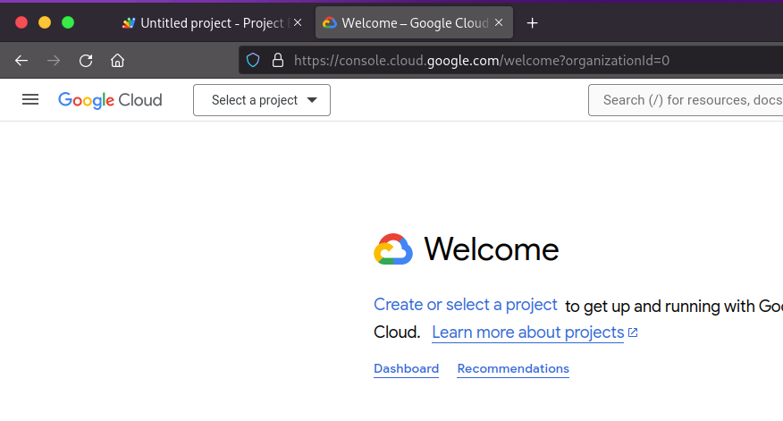

<br/>

2) Clique Novo Projeto

<br/>
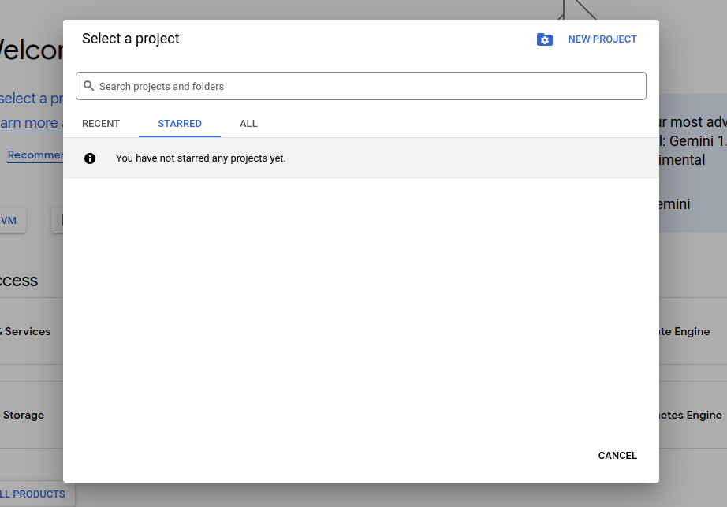

<br/>

3) Defina um nome para o seu projeto e selecione a organização (opcional)

<br/>
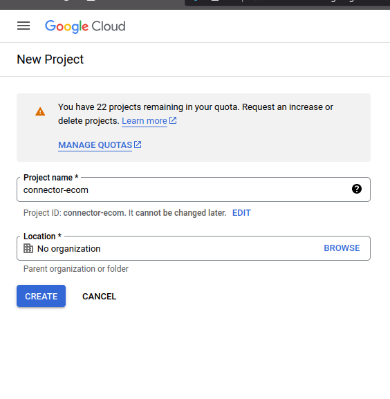

<br/>

4) Após criar o projeto, acesse o menu de pesquisa e procure por “oauth” e selecione “Tela de consentimento do OAuth”

<br/>
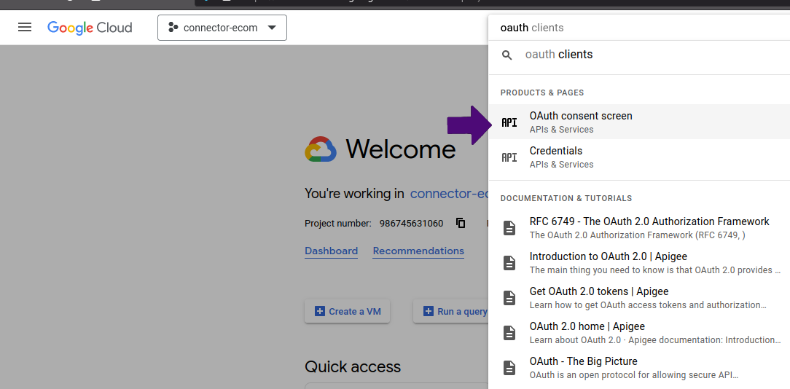

<br/>

<a id="a2"></a>

## Configurar tela de consentimento no Projeto Gcloud

1) Não é necessário selecionar o Tipo de Usuário, proceda aos passos de criação preenchendo os dados obrigatórios.

**Steps:**

* Tela de permissão OAuth
* Escopos
* Informações opcionais
* Resumo 

<br/>
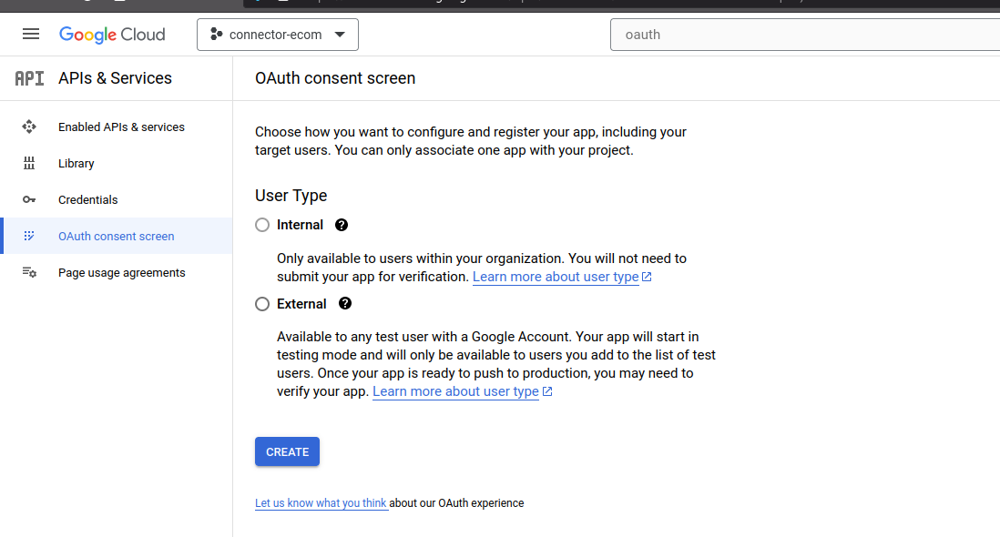

<br/>

2) In the last step of creation click "Voltar para o Painel"

<br/>
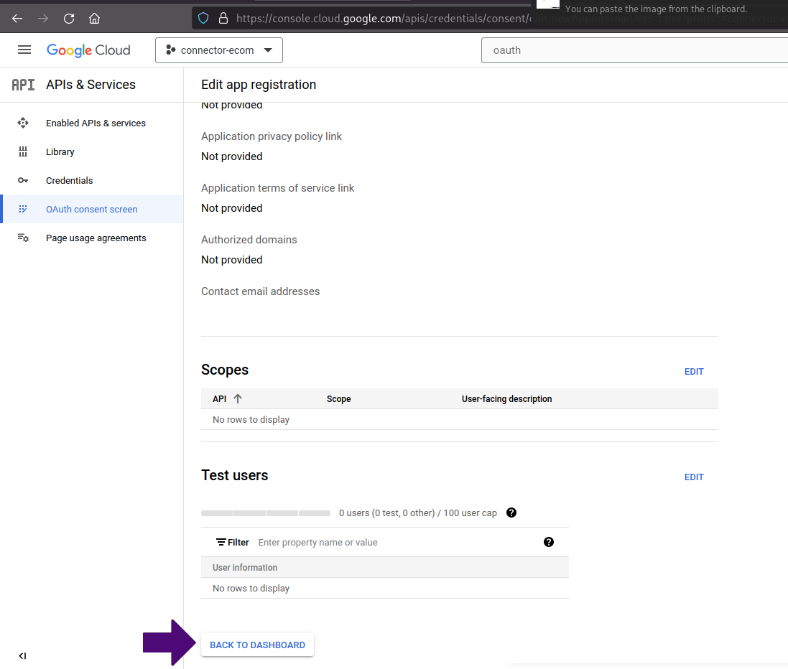

<br/>

3) Em seguida, clique em "Publicar aplicativo"

<br/>
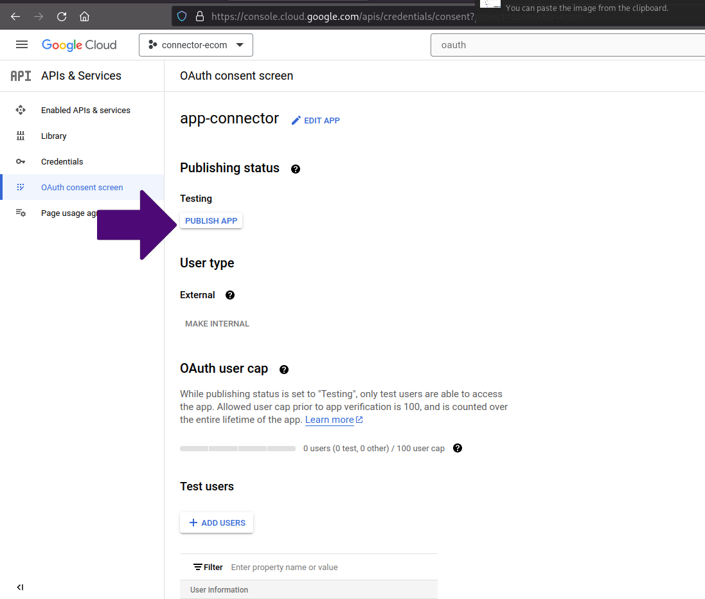

<br/>

4) Volte para a tela inicial do console Gcloud e copie o número do projeto

<br/>
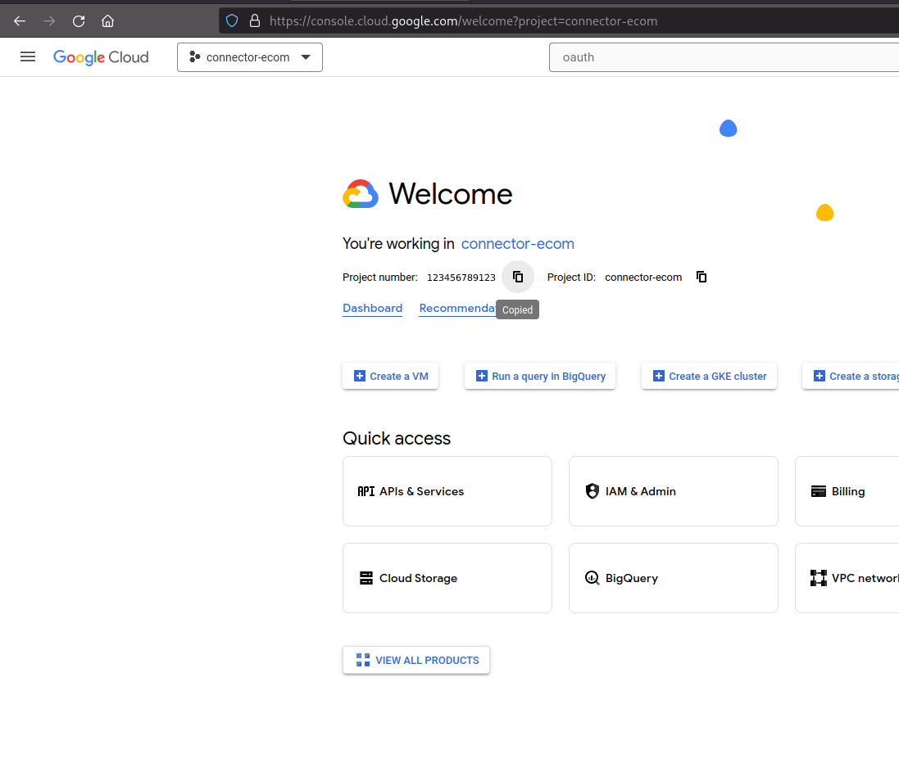

<br/>

<a id="a3"></a>

## Criar um appscript do Google

Com o mesmo projeto Gcloud é possível criar mais de um Connector

Neste exemplo, criaremos um conector que irá buscar todos os pedidos da sua loja e retornará os seguintes dados: **_Número do pedido, ID do pedido, número do documento, e-mail, ID do cliente, valor (total, subtotal, frete, desconto), pontos de fidelidade, status e itens (ID do produto, sku, quantidade, preço, preço final)_** - para que possam ser manipulados pelo Looker Studio

Para criar outros conectores, basta fazer as alterações necessárias nos arquivos `appscript.json` e `Código.gs` (especificamente no `schema` e na função `getData()`)

Vamos...

Acesse o [appscript do Google](https://script.google.com/)

1) Clique "Novo Projeto"

<br/>
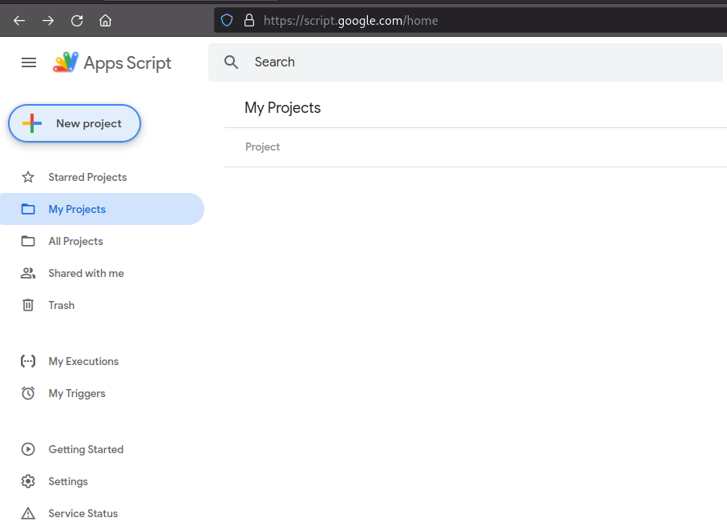

<br/>


2) Clique "Configurações do Projeto"

<br/>
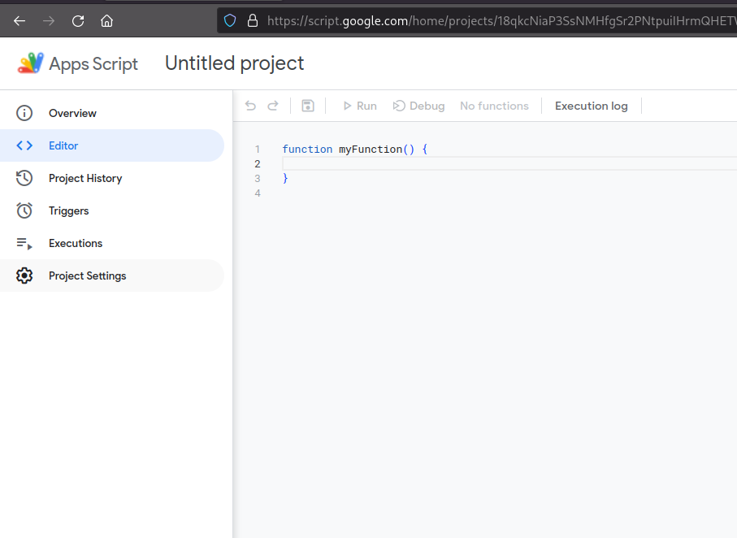

<br/>

2) Ative "Mostrar arquivo de manifesto "appsscript.json" no editor"

<br/>
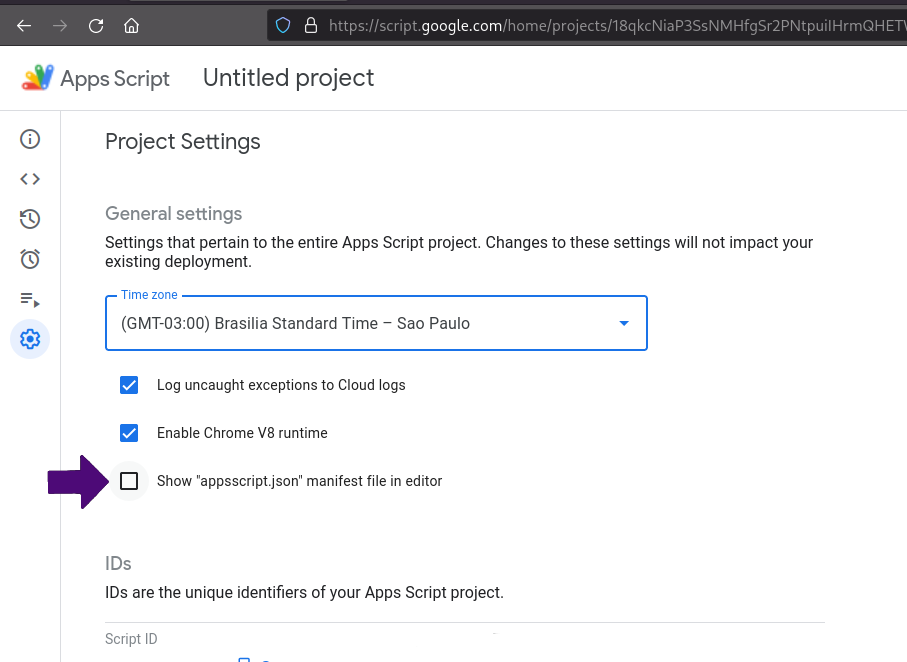

<br/>

2) Em "Projeto do Google Cloud Platform (GCP)"
* Clique "Alterar Projeto"
* Cole o Número do Projeto
* Clique "Definir Projeto"

<br/>
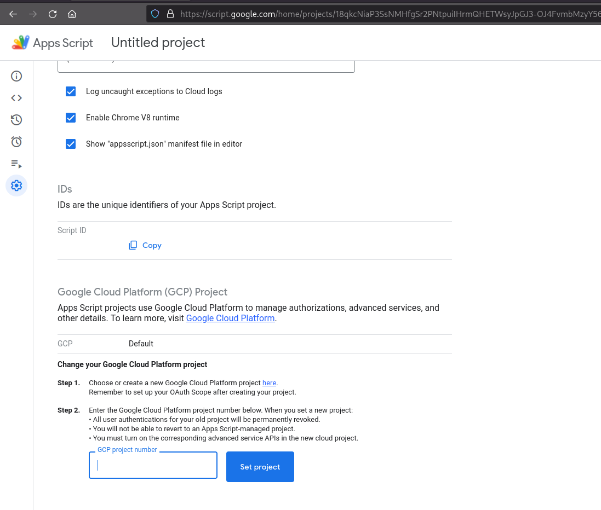

<br/>

3) Volte ao “Editor” e selecione o arquivo “appscript.json”
* Cole o Código
```JSON
{
  "timeZone": "America/Sao_Paulo",
  "dependencies": {},
  "exceptionLogging": "STACKDRIVER",
  "runtimeVersion": "V8",
  "dataStudio": {
    "name": "Orders E-com Plus",
    "company": "E-com Plus",
    "logoUrl": "https://avatars.githubusercontent.com/u/60898319?s=200&v=4",
    "addonUrl": "https://github.com/ecomplus/looker-studio-connectors",
    "supportUrl": "https://github.com/ecomplus/looker-studio-connectors/issues",
    "description": "Connector for E-com Plus API to get Orders"
  }
}
```
_**Obs.:** Se for outro conector, faça as alterações necessárias_

* Salve o arquivo

<br/>
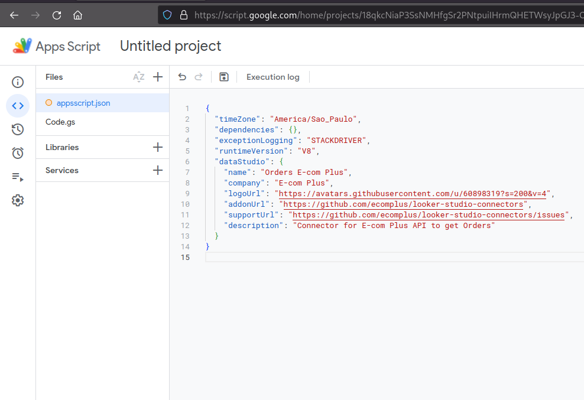

<br/>

4) Agora selecione o arquivo “Código.gs” e cole o código
 ```js
 // Define the schema for the data structure of the connector
const schema = [
  { name: '_id', label: 'Order ID', dataType: 'STRING', semantics: { conceptType: 'DIMENSION' } },
  { name: 'number', label: 'Order Number', dataType: 'NUMBER', semantics: { conceptType: 'DIMENSION' } },
  { name: 'status', label: 'Status', dataType: 'STRING', semantics: { conceptType: 'DIMENSION' } },
  { name: 'buyers._id', label: 'Customer ID', dataType: 'STRING', semantics: { conceptType: 'DIMENSION' } },
  { name: 'buyers.main_email', label: 'Customer E-mail', dataType: 'STRING', semantics: { conceptType: 'DIMENSION' } },
  { name: 'buyers.doc_number', label: 'Customer CPF/CNPJ', dataType: 'STRING', semantics: { conceptType: 'DIMENSION' } },
  { name: 'amount.total', label: 'Order Total', dataType: 'NUMBER', semantics: { conceptType: 'DIMENSION' } },
  { name: 'amount.subtotal', label: 'Order SubTotal', dataType: 'NUMBER', semantics: { conceptType: 'DIMENSION' } },
  { name: 'amount.discount', label: 'Order Discount', dataType: 'NUMBER', semantics: { conceptType: 'DIMENSION' } },
  { name: 'amount.freight', label: 'Order Freight', dataType: 'NUMBER', semantics: { conceptType: 'DIMENSION' } },
  { name: 'items.product_id', label: 'Product ID', dataType: 'STRING', semantics: { conceptType: 'DIMENSION' } },
  { name: 'items.sku', label: 'Product SKU', dataType: 'STRING', semantics: { conceptType: 'DIMENSION' } },
  { name: 'items.quantity', label: 'Product Quantity', dataType: 'NUMBER', semantics: { conceptType: 'METRIC' } },
  { name: 'items.price', label: 'Product Price', dataType: 'NUMBER', semantics: { conceptType: 'METRIC' } },
  { name: 'items.final_price', label: 'Product Final Price', dataType: 'NUMBER', semantics: { conceptType: 'METRIC' } },
  { name: 'loyalty_points.name', label: 'Loyalty Points Name', dataType: 'STRING', semantics: { conceptType: 'DIMENSION' } },
  { name: 'loyalty_points.value', label: 'Loyalty Points Value', dataType: 'NUMBER', semantics: { conceptType: 'METRIC' } },
  { name: 'created_at', label: 'Created', dataType: 'STRING', semantics: { conceptType: 'DIMENSION', semanticType: 'YEAR_MONTH_DAY_SECOND'} },
  
]

// Return the defined schema to Data Studio
function getSchema(request) {
  return { schema: schema }
}

const cc = DataStudioApp.createCommunityConnector()
// Base API endpoint
const BASE_URL = 'https://api.e-com.plus/v1'

function md5(inputString) {
  return Utilities.computeDigest(Utilities.DigestAlgorithm.MD5, inputString)
    .reduce((output, byte) => output + (byte & 255).toString(16).padStart(2, '0'), '')
}

function getAuthType() {
  return cc.newAuthTypeResponse()
    .setAuthType(cc.AuthType.USER_PASS)
    .build()
}

// Check if the current user has administrative privileges
function isAdminUser() {
  return true
}

function resetAuth() {
  var userProperties = PropertiesService.getUserProperties()
  // userProperties.deleteProperty('dscc.key')
  userProperties.deleteProperty('ecom.authenticationId')
  userProperties.deleteProperty('ecom.apiKey')
  userProperties.deleteProperty('ecom.storeId')
  userProperties.deleteProperty('ecom.accessToken')
  userProperties.deleteProperty('ecom.expires')
}

async function requestAuthEcomplus(authenticationId, apiKey, storeId) {
  const body = {
    _id: authenticationId,
    api_key: apiKey
  }

  const options = {
    payload: JSON.stringify(body),
    headers: {
      'x-store-id': storeId
    }
  }
  return UrlFetchApp.fetch(`${BASE_URL}/_authenticate.json`, options)
}

function getUser() {
  const userProperties = PropertiesService.getUserProperties()
  const authenticationId = userProperties.getProperty('ecom.authenticationId')
  const apiKey = userProperties.getProperty('ecom.apiKey')
  const storeId = userProperties.getProperty('ecom.storeId')
  const accessToken = userProperties.getProperty('ecom.accessToken')
  return {
    userProperties,
    authenticationId,
    apiKey,
    storeId,
    accessToken
  }
}

async function isAuthValid() {
  const {
    userProperties,
    authenticationId,
    apiKey,
    storeId
  } = getUser()

  let accessToken = userProperties.getProperty('ecom.accessToken')
  const expires = userProperties.getProperty('ecom.expires')
  if (expires) {
    const dateExpires = new Date(expires).getTime()
    const now = new Date().getTime()
    if (now > (dateExpires - 1 * 60 * 60 * 1000)) {
      const resAuth = await requestAuthEcomplus(authenticationId, apiKey, storeId)
      if (resAuth.getResponseCode() !== 200) {
        return false
      }
      const responseAuth = JSON.parse(resAuth)
      userProperties.setProperty('ecom.accessToken', responseAuth.access_token)
      userProperties.setProperty('ecom.expires', responseAuth.expires)
      accessToken = responseAuth.access_token
    }
    const headers = {
      'x-store-id': storeId,
      'x-my-id': authenticationId,
      'x-access-token': accessToken
    }
    var res = UrlFetchApp.fetch(`${BASE_URL}/authentications/me.json`, { headers,  'muteHttpExceptions': true })
    return res.getResponseCode() === 200
  } else {
    return false
  }
}

async function setCredentials(request) {
  const rawUserParts = request.userPass.username.split(':')
  let storeId = 0
  let authUsername = ''
  let authId = ''
  if (rawUserParts.length === 2) {
    storeId = Number(rawUserParts[0])
    authId = rawUserParts[1]
  } else {
    authUsername = rawUserParts[0]
  }
  const rawPass = request.userPass.password
  let authApiKey = storeId && rawPass.length === 128 ? rawPass : ''
  const authPassMd5 = authApiKey ? '' : md5(rawPass);
  let loginData
  if (!authApiKey) {
    const resp = UrlFetchApp.fetch(`${BASE_URL}/_login.json`, {
      payload: JSON.stringify({
        username: authUsername,
        pass_md5_hash: authPassMd5,
      }),
      method: 'POST',
      headers: {
        'content-type': 'application/json',
        'x-store-id': storeId
      },
    });
    if (resp.getResponseCode() !== 200) {
      return cc.newSetCredentialsResponse()
        .setIsValid(false)
        .build()
    }
    loginData = JSON.parse(resp)
  }
  if (loginData) {
    storeId = loginData.store_id
    authId = loginData._id
    authApiKey = loginData.api_key
  }

  var userProperties = PropertiesService.getUserProperties()
  userProperties.setProperty('ecom.authenticationId', authId)
  userProperties.setProperty('ecom.apiKey', authApiKey)
  userProperties.setProperty('ecom.storeId', `${storeId}`)
  
  const resAuth = await requestAuthEcomplus(authId, authApiKey, `${storeId}`)
  if (resAuth.getResponseCode() !== 200) {
    return cc.newSetCredentialsResponse()
      .setIsValid(false)
      .build()
  }
  const responseAuth = JSON.parse(resAuth)
  userProperties.setProperty('ecom.accessToken', responseAuth.access_token)
  userProperties.setProperty('ecom.expires', responseAuth.expires)

  return cc.newSetCredentialsResponse()
    .setIsValid(true)
    .build()
}

function getConfig(request) {

}

function getData(request) {
  if (isAuthValid()) {
    const {
      userProperties,
      authenticationId,
      storeId,
      accessToken
    } = getUser()

    const dataSchema = schema.reduce((init, current) => {
      const isExist = request.fields.find(field => field.name === current.name)
      if (isExist) {
        init.push(current)
      }
      return init
    }, [])

    const listOrdersUrl = BASE_URL + '/$aggregate.json'
    const headers = {
      'X-Access-Token': accessToken,
      'X-Store-ID': storeId,
      'X-My-ID': authenticationId
    }

    const body= {
     "resource": "orders",
      "pipeline": [
         {
            "$project": {
                "number": 1,
                "status": 1,
                "buyers.doc_number": 1,
                "buyers.main_email": 1,
                "buyers._id": 1,
                "amount": 1,
                "loyalty_points": 1,
                "items.product_id": 1,
                "items.sku": 1,
                "items.quantity": 1,
                "items.price": 1,
                "items.final_price": 1,
                "created_at": 1
            }
        },
        {
            "$unwind": {
                "path": "$items",
                "preserveNullAndEmptyArrays": true
            }
        }
      ]
    }

    const options = {
      headers,
      payload: JSON.stringify(body),
      method: 'POST'
    }

    const resAggregation = UrlFetchApp.fetch(listOrdersUrl, options)
    const parseAggregation = JSON.parse(resAggregation)
    const aggregation = parseAggregation.result
   
    const rows = aggregation.map(order => {
      const values = dataSchema.map(field => {
        if(field.name.startsWith('buyers')){
          const fields = field.name.split('.')
          const customer = order[fields[0]] && order[fields[0]].length && order[fields[0]][0][fields[1]]
          return customer ? customer : (field.dataType === 'NUMBER' ? 0 : '') 
        }
        if(field.name.startsWith('loyalty_points')){
          const fields = field.name.split('.')
          const loyaltyPoints = order[fields[0]]
          const keys = Object.keys(loyaltyPoints)
          category[keys[0]][fields[1]]

          return loyaltyPoints && keys && keys.length
            ? loyaltyPoints[keys[0]][fields[1]]
            : field.dataType === 'NUMBER' ? 0 : ''
        }
        if(field.name.startsWith('amount')){
          const fields = field.name.split('.')
          const amount = order[fields[0]] && order[fields[0]][fields[1]]
          return amount || 0
        }
        if(field.name.startsWith('items')){
          const fields = field.name.split('.')
          const amount = order[fields[0]] && order[fields[0]][fields[1]]
          return amount || 0
        }
        if(field.name.startsWith('created_at')){
          const dateString = order[field.name].split('T')
          let date = dateString[0].replaceAll('-','')
          date += dateString[1].split('.')[0].replaceAll(':','')
          return date
        }
        return order[field.name] || typeof order[field.name] === 'number' ? order[field.name] : ''
      })
      return { values }
    })

    return {
      schema: dataSchema,
      rows
    }
  }
  return {
    schema: [],
    rows: []
  }
}

 ```
 _**Obs.:** Se for outro conector, faça as alterações necessárias_

 * Salve o arquivo

 <br/> 

 5) Para implantar o conector clique em "Implantar"

* Clique em "Nova Implantação"
* Clique em "Selecionar Tipo"
* E selecione Add-on _ e _ Library_

<br/>
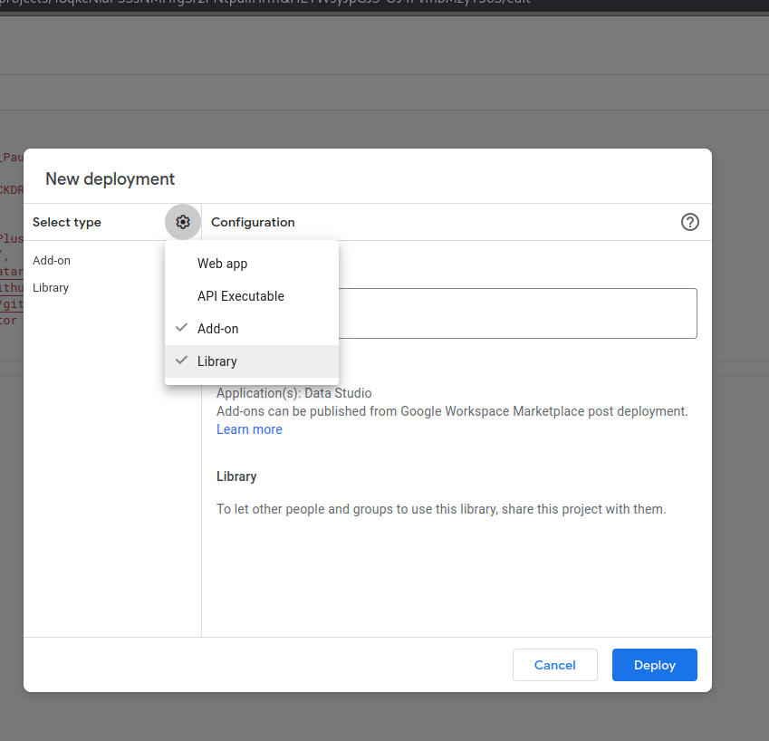

<br/>

* Acrescente uma descrição
* E clique em "Implantar"

<br/>
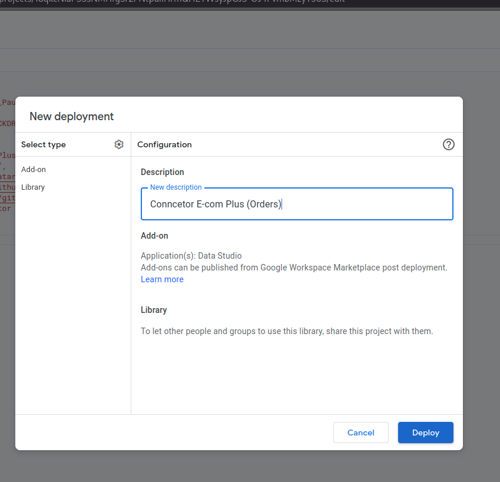

<br/>

6) Copie o "ID de implantação"

<br/>
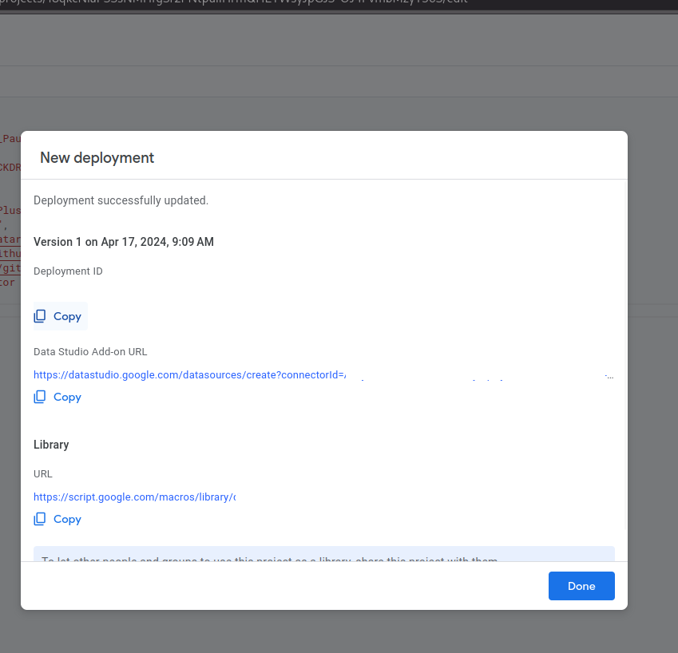

<br/>

<a id="a4"></a>

## Conectar appscript no Looker Studio

Access the [Looker Studio](https://lookerstudio.google.com/)

1) Clique em “Relatório em Branco”

<br/>
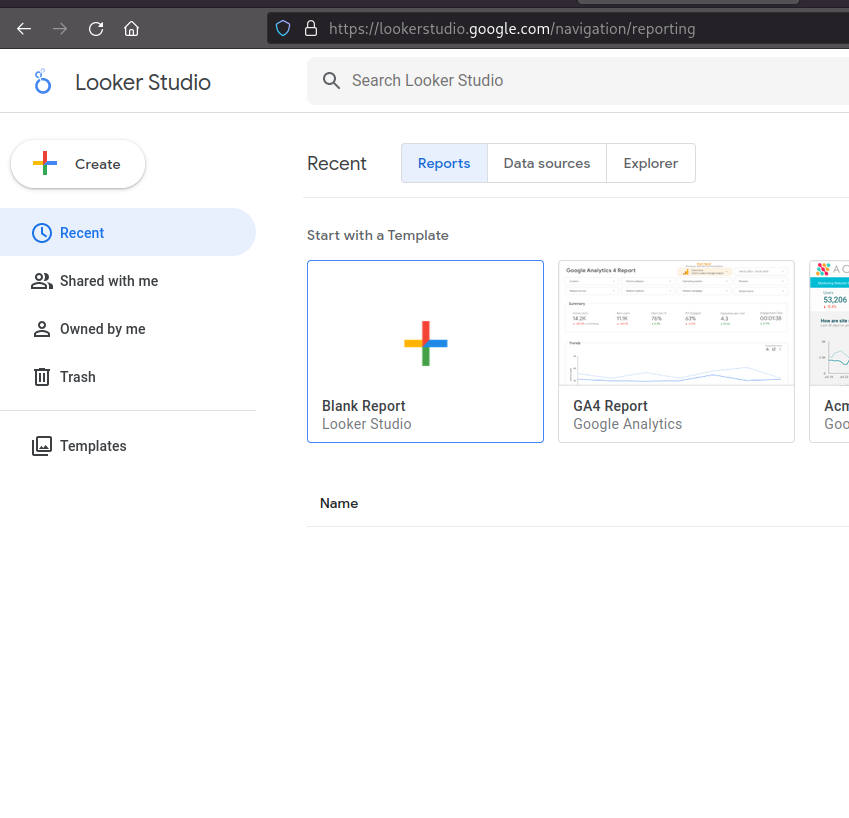

<br/>

2) Clique em "Adicionar Dados"

<br/>
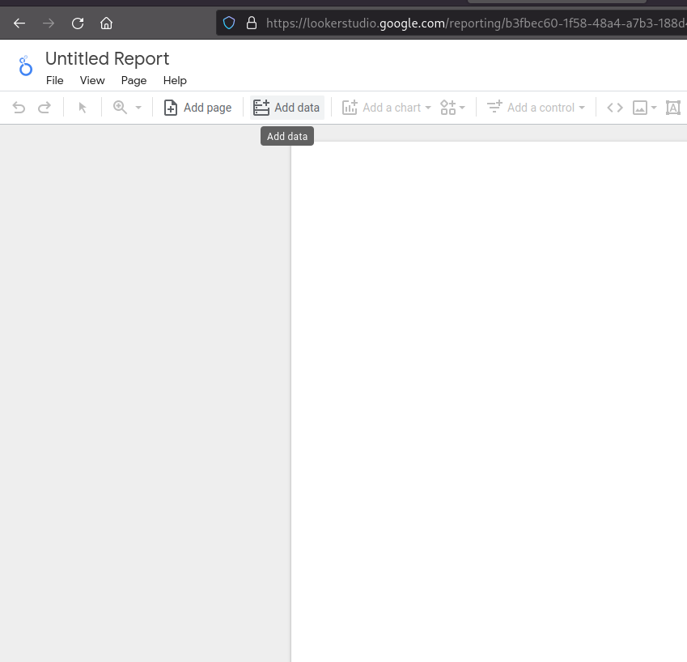

<br/>

3) Role a página até "Partner Connectors" e aguarde carregar, selecione "Construir seu próprio"

<br/>
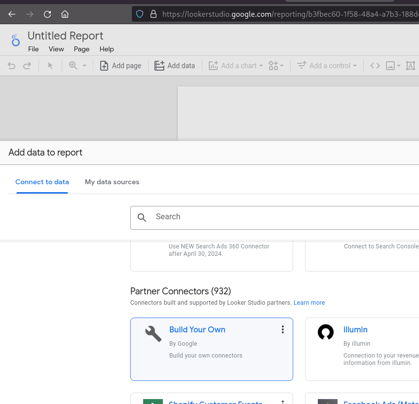

<br/>

4) Cole seu “ID de implantação” e clique em “Validar”

<br/>
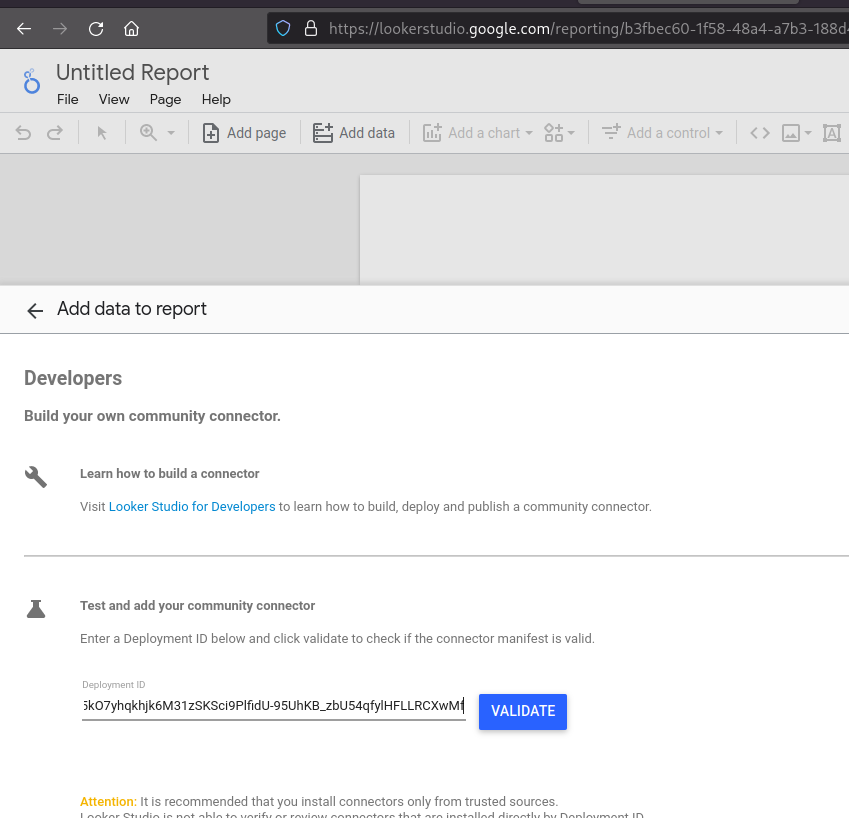

<br/>

5) Selecione o conector

<br/>
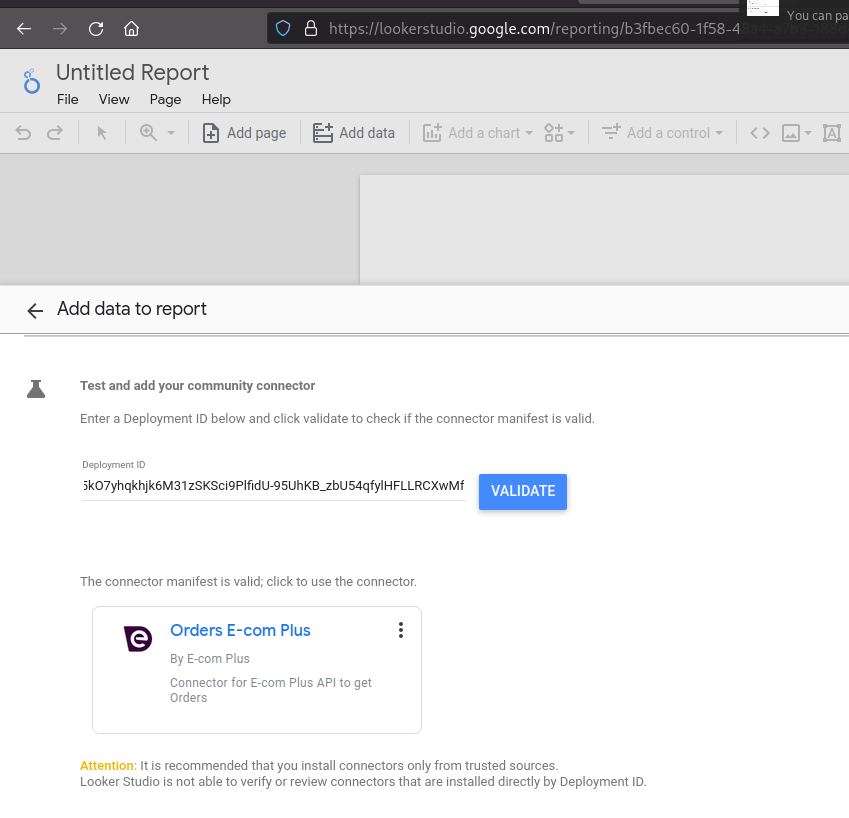

<br/>

6) Clique em “Autorizar”, então você será redirecionado para a tela de consentimento que criou inicialmente.

<br/>
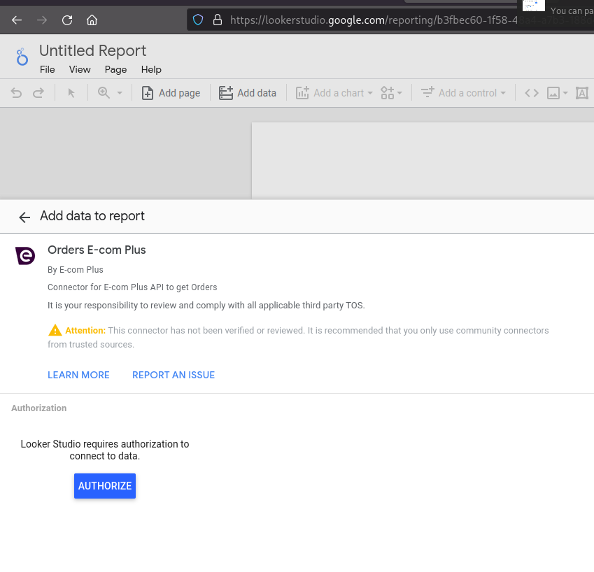

<br/>

7) Como seu app é privado e ainda não totalmente aprovado, essa tela de segurança irá aparecer, basta autorizar seu próprio app clicando em "Avançado"

<br/>
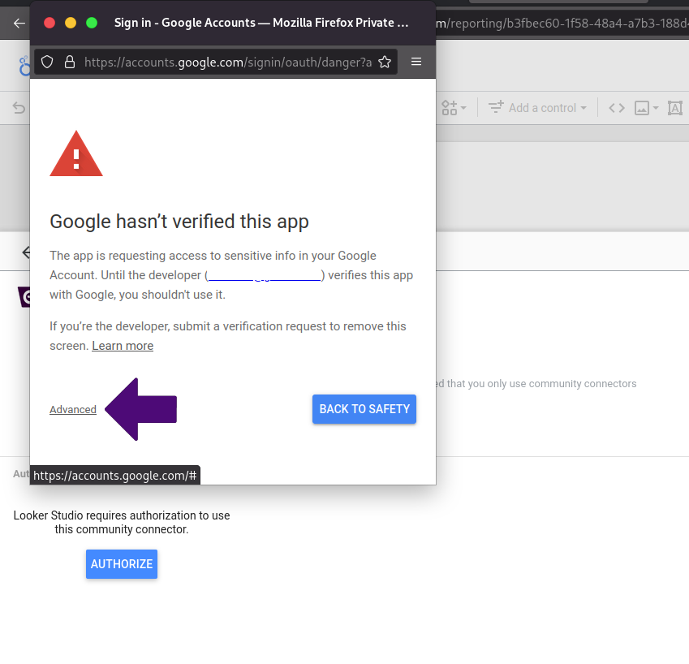

<br/>

8) E depois "Vá para seu_app_nome"

<br/>
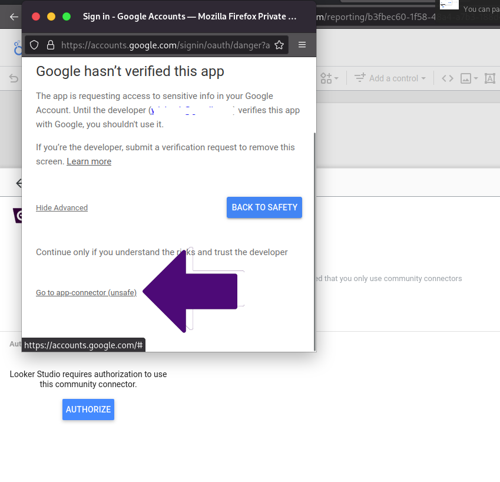

<br/>

9) Finalize o consentimento clicando em “Permitir”

10) Se tudo correr bem você verá uma tela de login do conector criado, aqui você irá inserir as credenciais de acesso à sua loja no E-com Plus, e clicar em “Enviar”

<br/>
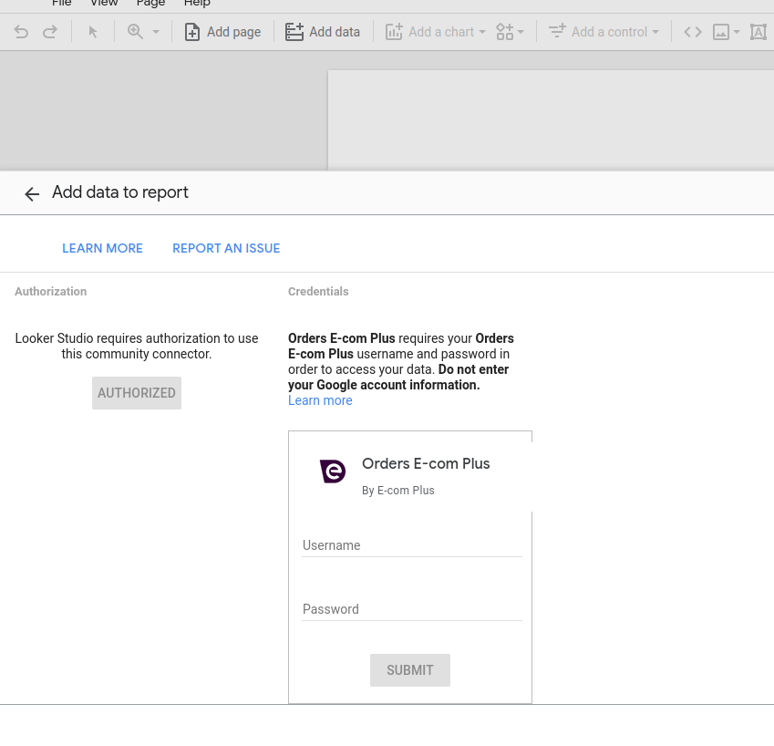

<br/>

11) Caso seu acesso seja bem-sucedido, clique em “Adicionar”,

Seu conector está instalado em seu "Relatório"

<br/>
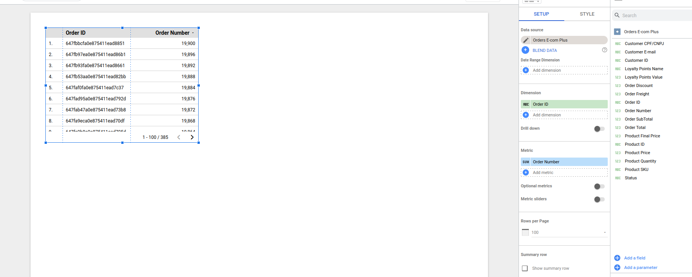

<br/>

## Mais

Para criar outros conectores, repita os passos:
* [Criar um appscript do Google](#a3)
* [Conectar appscript ao Looker Studio](#a4)